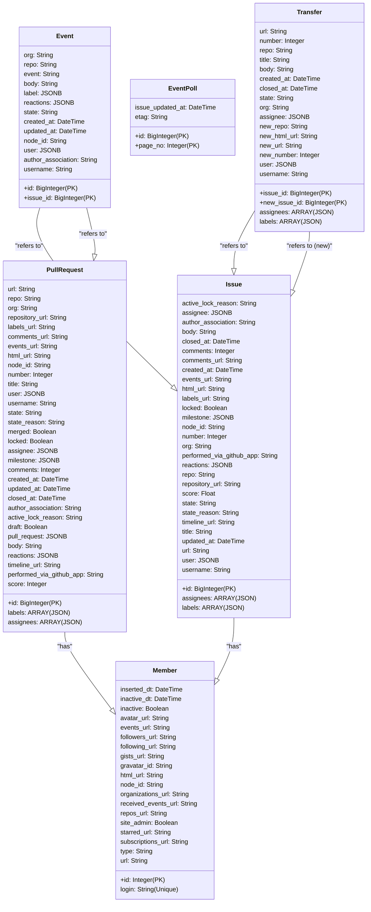

# Contributor Metrics

Backend infrastructure to track and manage metrics of GitHub projects by monitoring issues, pull requests, and events using AWS services and Python.

## Storage & ETL

This app is designed to continually monitor and update GitHub project metrics using various GitHub APIs. Below is the detailed breakdown of its structure and functionalities:

### **Initial Setup**

At the onset, the necessary modules are imported and instances of `GitHubAPI`, `TimelineAPI`, and `TransferAPI` are set up with the requisite tokens. A database session is established using credentials derived from the AWS Systems Manager Parameter Store. These initializations take place exclusively when the app operates in an AWS Lambda environment, bypassing the AWS Chalice CLI mode.

### **Scheduled Functions**

The app has three scheduled Lambda functions to facilitate tasks at different intervals: every 30 minutes, every 10 minutes, and daily at 5:00 am UTC.

#### **1. every_30_min**

- **Frequency:** Every 30 minutes
- **Tasks:**
  - Registers and updates new Pull Requests (PRs) and Issues formulated within defined temporal thresholds.
  - Refreshes the status of PRs and recently closed PRs in the database.
  - Reconciles the status of unmerged, closed PRs tracing back to one year (configurable).
  - Updates any novel team member data daily (for an organization).
  - Manages issue transfers via transferred issue reconciliations.

#### **2. nrt_events**

- **Frequency:** Every 10 minutes
- **Tasks:**
  - Records near-real-time (NRT) events pertaining to issue activities from a day before the current date.
  - Reconciles transferred issues.

#### **3. daily**

- **Frequency:** Daily at 5:00 am UTC
- **Tasks:**
  - Checks historical "closed" state daily, reconciling the merged/not-merged states of closed PRs since a given date.

### **Endpoints**

As of now, the app does not expose any API endpoints, functioning predominantly on background tasks scheduled at various intervals to renew the database with recent GitHub information.

### **Libraries and Modules**

- **Chalice**
- **GitHubAPI, TimelineAPI, TransferAPI:** Custom libraries for different parts of the GitHub API.
- **chalicelib.utils:** Auxiliary functions, including `get_parameter`.
- **chalicelib.models:** Database models such as `PullRequest` and `Issue`.

### **Database**

Compatible with sqlalchemy dialects.

## Deployment

The deployment of the backend scheduled Lambda functions is managed by [AWS Chalice](https://aws.github.io/chalice/index.html).

```
chalice deploy
```

### Secrets

Create secure parameters (_SecureString_) in AWS Systems Manager
Parameter Store to coincide with the pattern as specified in `app.py`. For example -

```
token = get_parameter("/contributor-metrics/{env-name}/{var-name}", True)
db_url = get_parameter("/contributor-metrics/{env-name}/{var-name", True)
```

### Database

Create the database tables using `create_all()`. This will create `PullRequest`, `Member`, `Issue`, `Event`, `Transfer`, and `EventPoll` tables. The below example loads the environment variables using `dotenv`. When deployed, these secrets are retrieved from SSM (above).

```python

if __name__ == "__main__":
    import os
    from dotenv import load_dotenv
    from models import Member, PullRequest, Issue, create_all, create_db_session

    load_dotenv()

    token = os.getenv("GH_TOKEN")
    db_url = os.getenv("DB_URL")

    gh = GitHubAPI(token=token)
    db = create_db_session(db_url)

    create_all(db_url)

```

### Backfilling data

For backfilling historical data, utilize the backfill.py script available in the repository. It's recommended to chunk the time periods for backfilling to avoid hitting GitHub's rate limit. Adjust the time frames appropriately to remain within the rate limits while fetching historical data. This script makes it easy to backfill data for specified repositories and events by automating the process and handling the GitHub API's rate limits gracefully.

## Development

### Lambda environment

The Lambdas make use of Python, SQLAlchemy, and the GitHub API.

To develop locally, create a Python virtual environment using `requirements.txt`.

```
pyenv virtualenv 3.8.3 contributor-metrics
pyenv activate contributor-metrics
```

```
pip install -r requirements.txt
```

Activate the environment:

```
pyenv contributor-metrics
```

### Custom policy

The `policy.json` provides access from the Lambda functions to the secrets stored in SSM.

```
{
  "Effect": "Allow",
  "Action": [
      "ssm:GetParameter"
  ],
  "Resource": "arn:*:ssm:*:*:parameter/contributor-metrics/*/*"
}
```

This is added in the `config.json`.

## Appendix: Database


